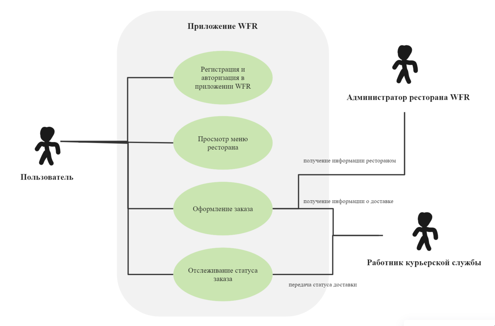
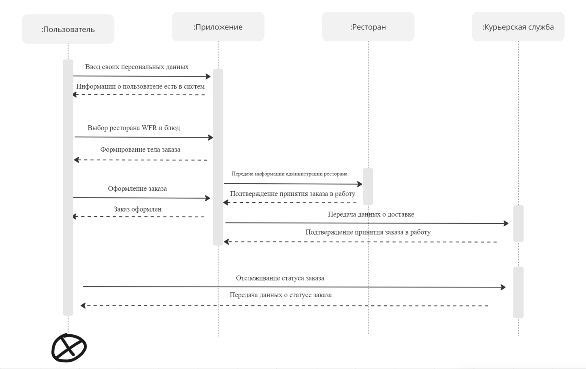
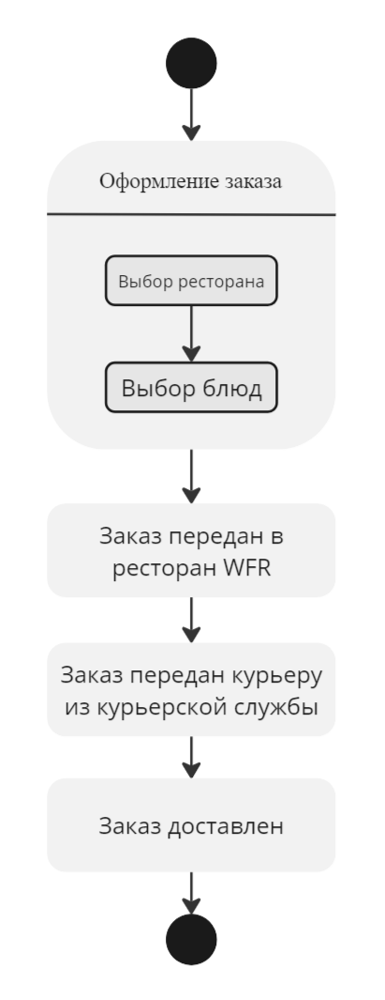
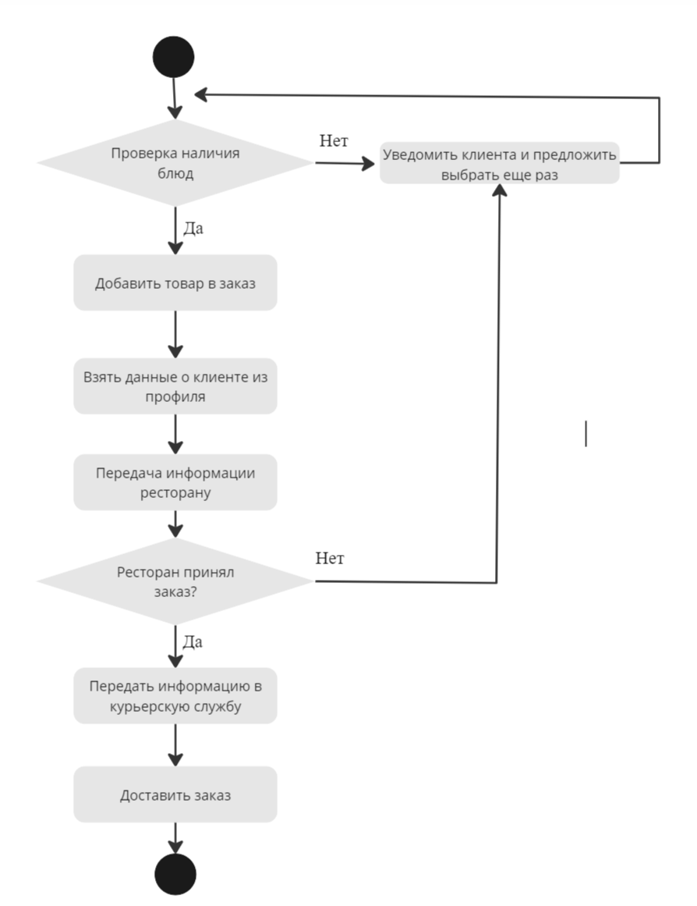
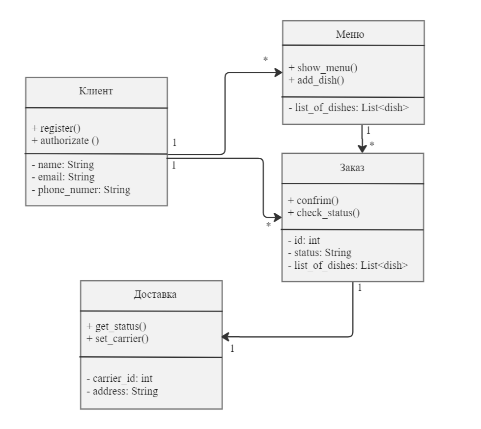

# Описание концепции приложения
В рамках ТЗ3 было необходимо разработать, приложение для заказа еды из ресторанов. Так как описаны лишь общие условия, например: необходима работа с несколькими ресторанами, стоит зафиксировать то, как именно будет работать приложение. В качестве разрабатываемого приложения рассмотрим систему, в которой пользователь через приложение и исключительно через него заказывает еду из партнёрских ресторанов. Так список ресторанов будет ограничен и определен заранее, допустим в нашем случае это будет ресторанная группа, например, white rabbit family (далее – WRF). Тогда у пользователя есть широкий выбор из ресторанов, однако все они имеют схожее устройство – поэтому процесс взаимодействия сервиса и ресторана будет одинаков. Для пользователя должен быть доступен следующий функционал: выбор ресторана из группы WRF, добавление в корзину интересующих позиций из меню, оформление доставки по адресу. 
Система представляет собой мобильное и веб-приложение для заказа еды из ресторанов группы WRF. Пользователи могут просматривать меню различных ресторанов группы, добавлять блюда в корзину, оформлять и оплачивать заказы, а также отслеживать статус их выполнения и доставки. Курьеры WFR получают информацию о заказах, забирают их из ресторанов и доставляют пользователям. Администрация ресторанов управляет своим меню и заказами. Основные участники системы:
1.	Пользователи: клиенты, заказывающие еду.
2.	Курьеры: сотрудники, доставляющие заказы.
3.	Администрация ресторанов: управляющие, которые добавляют и редактируют меню, управляют заказами.

## Диаграмма вариантов использования

## Диаграмма последовательности
Отметим ключевые моменты во взаимодействии акторов:
1.	Выбор ресторана и формирование корзины
2.	Оформление заказа
3.	Передача информации в ресторан и в курьерскую службу

## Диаграмма состояний

Диаграмма состояний призвана изобразить процесс перехода между этапами работы приложения, рассмотрим, как это выглядит в нашем случае:
1.	Первый этап – создание заказа, выбор клиентом блюд и заведения
2.	Второй этап – принятие заказа в работку рестораном WFR
3.	Третий этап – передача готового заказа из ресторана в курьерскую службу
4.	Финальный этап цепочки – передача заказа клиенту

## Диаграмма деятельности
Диаграмма деятельности отображает процессы, которые происходят при использовании приложения и их возможные ветвления

## Диаграмма классов
Диаграмма деятельности отображает классы, которые должны быть использованы при работе приложения и их корреляции

